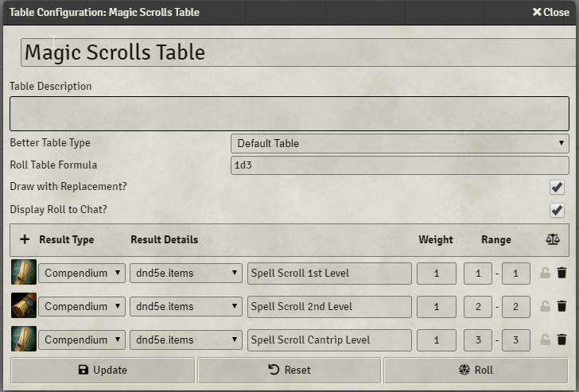
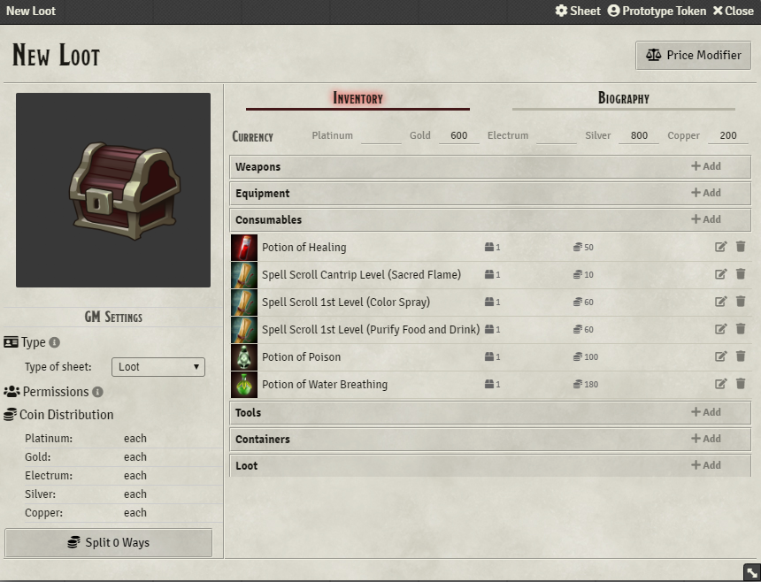
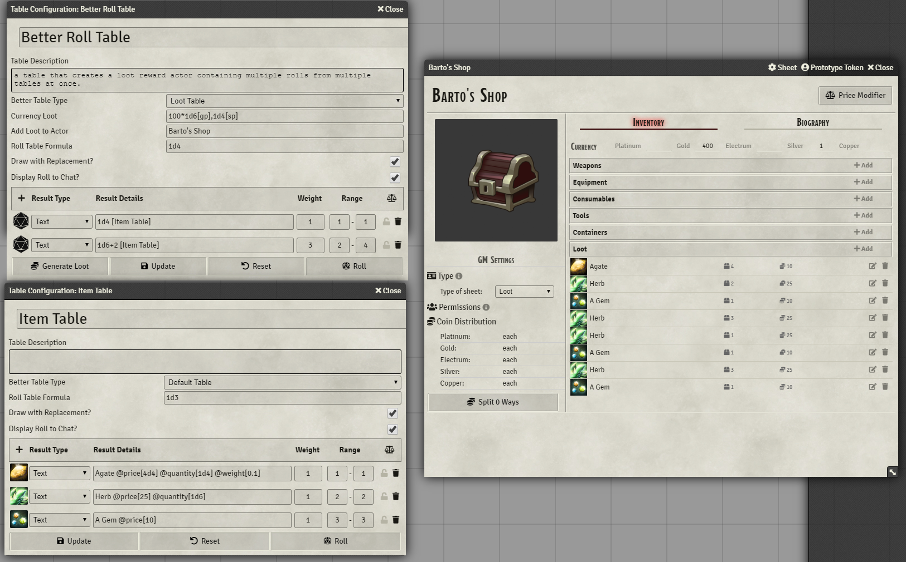
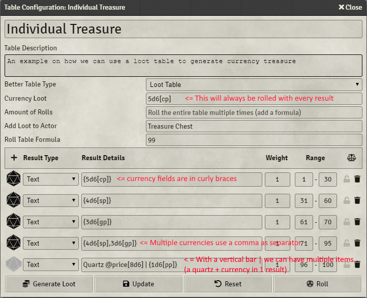
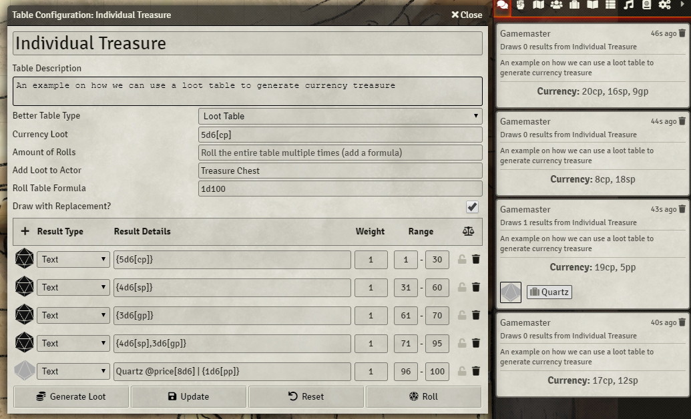

    

# Better Rolltables #
*better-rolltables* is Module for FoundryVTT to improve and add functionality to rolltables

The module adds functionality to rolltables to enhance loot generation capabilities and rolling on multiple tables with 1 click!(implementing for example the Treasure Hoard" Tables from the DMG becomes possible)

### Intro video
[](https://www.youtube.com/watch?v=TRg4y0joOKA)

Wiki: https://github.com/ultrakorne/better-rolltables/wiki

## Features ##

* Roll on multiple tables with roll formulas
* Auto create a loot actor to store generated loot
* Auto roll random spells when a scroll is selected as loot
* A table can specify multiple currencies (with roll formulas) to always be awarded

### Requirements ###

* I strongly suggest to use **loot sheet NPC** (https://github.com/jopeek/fvtt-loot-sheet-npc-5e). if you have that module installed, better rolltable loot generator will automatically use it


### How to use it ###
**Note for 0.5.7+ users**: do not add additional text to roll formulas ```1d6 of [tableName]``` does not work and you have to do simply ```1d6 [tableName]```

1. Open a RollTable or create a new one
1. Change *Better Table type* to "Loot Table" (just under the table description field)
1. if you want to generate currency with the loot use the field *Currency loot*. currencies accept formulas and in squre brackets the currency type. You can add multiple currency and separate them with a comma. `(1d10+2)*100[gp], 1d10*100[sp], 200[cp]`
1. You can roll formula on multplie table by adding an entry of type Text in the rollTable and use the following syntax: `1d6 [Magic Scrolls Table] | 1d4 [Potions Table]` This will roll 1d6 times on a table named *Magic Scrolls Table* and 1d4 on a table named *Potions Table*
1. Remember to hit *update* on the table if you change values (or enter after you typed)
1. Click **Generate Loot** when you are done
1. You will find your loot actor in the Actor's directory, named *New Loot*

### Auto Roll Random Scrolls Spells ###

if you have some scrolls with this naming, as in the picture below a random spell will be selected using the dnd5e.spell compendium



The picture below is an example of random loot generated with the example table table



### Creating Items on the Fly with random value ###

Especially for gems it is useful to create items on the fly that do not exist in a compendium or anywhere else.
You can create a Text result type in a table, give it name, set an image and use
@price[formula] to set the price of the item
@quantity[formula] for having more than 1 item and 
@weight[formula] if you wanna assign a weight to the item




### Adding currencies as text entries in the table ###

you can have text table entries to reward currency! The syntax is `{1d6+2[gp], 1d4+1[pp]}`, check example on how to combine it with other loot in the same line.



### Rolling to Chat

From version 0.8 when a loot table is selected you can use the normal "Roll" Button to do a better roll that will be posted as a chat card (respecting the chat privacy setting selected)



FAQs
https://github.com/ultrakorne/better-rolltables/wiki/FAQ

### Contacts
Ultrakorne#6240
